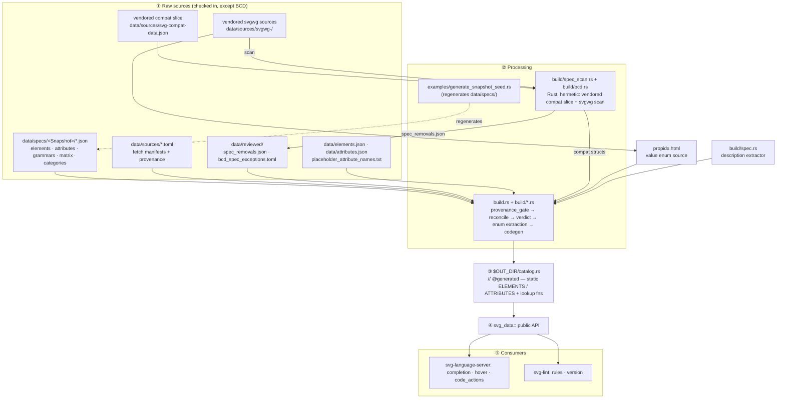

# Spec / Compat Data Pipeline

How SVG spec data and browser-compatibility data flow from raw upstream sources,
through build-time processing, into the runtime catalog the language server
consumes.

**One crate owns everything: [`crates/svg-data`](crates/svg-data/).** Every other
crate reaches the data through `svg_data::` imports. The build script
(`crates/svg-data/build.rs`) bakes all sources into a single generated
`catalog.rs`, included at compile time by
[`crates/svg-data/src/catalog.rs:7`](crates/svg-data/src/catalog.rs):

```rust
include!(concat!(env!("OUT_DIR"), "/catalog.rs"));
```

## Flow



---

## ① Sources (raw / upstream)

All default build inputs are checked into the repo. Network access is only used
for explicit refresh overrides or runtime freshness checks.

| Path                                                                                       | Format      | Authority                  | Holds                                                                                                                                 |
| ------------------------------------------------------------------------------------------ | ----------- | -------------------------- | ------------------------------------------------------------------------------------------------------------------------------------- |
| `crates/svg-data/data/specs/`: `Svg{11Rec{20030114,20110816},2{Cr20181004,EditorsDraft}}/` | JSON        | W3C SVGWG (pinned commits) | Per-snapshot `elements.json`, `attributes.json`, `grammars.json`, `element_attribute_matrix.json`, `categories.json`, `snapshot.json` |
| `crates/svg-data/data/sources/*.toml`                                                      | TOML        | manual curation            | Fetch manifests: upstream URLs, git refs, cache policy. Includes the **propidx declaration** (see gap below)                          |
| `crates/svg-data/data/sources/foreign-references.toml`                                     | TOML        | manual                     | External spec refs (ARIA, CSS, FXTF) — provenance only, not fetched                                                                   |
| `crates/svg-data/data/derived/overlays/*.json`                                             | JSON        | computed                   | Element/attribute deltas between adjacent snapshots                                                                                   |
| `crates/svg-data/data/derived/union/*.json`                                                | JSON        | computed                   | Feature-membership union across all snapshots                                                                                         |
| `crates/svg-data/data/reviewed/spec_removals.json`                                         | JSON        | extracted (svgwg)          | Audit of defined/removed/obsoleted elements & attributes w/ provenance                                                                |
| `crates/svg-data/data/reviewed/bcd_spec_exceptions.toml`                                   | TOML        | manual audit               | Allowlist of tolerated BCD ↔ spec disagreements                                                                                       |
| `crates/svg-data/data/elements.json`, `data/attributes.json`                               | JSON        | manual curation            | Curated element/attribute catalog overrides (descriptions, MDN URLs)                                                                  |
| `crates/svg-data/data/placeholder_attribute_names.txt`                                     | text        | manual blocklist           | BCD/web-features IDs that aren't real SVG attribute names                                                                             |
| `crates/svg-data/data/schemas/*.schema.json`                                               | JSON Schema | manual                     | Validation shapes for all snapshot data                                                                                               |
| `crates/svg-data/data/sources/svg-compat-data.json`                                        | JSON        | MDN / web-features         | Vendored browser support + baseline compat slice emitted by the svg-compat worker                                                     |
| `crates/svg-data/data/sources/svgwg-*/`                                                    | HTML/XML    | W3C SVGWG                  | Vendored upstream spec source scanned for descriptions, removals, inventories, and value enums                                        |

---

## ② Processing (intermediate)

Ordered by stage — input → mechanism → output.

### Spec scan (Rust, hermetic)

- **In**: vendored `definitions*.xml`, `text.html`, `changes.html` under
  `data/sources/svgwg-<sha>/master/`.
- **Mechanism**: regex tag/prose parsing in `build/spec_scan.rs` (ported from
  the former Deno worker; no network, no Deno toolchain).
- **Out**: `crates/svg-data/data/reviewed/spec_removals.json`.

### BCD load (Rust, hermetic)

- **In**: the **vendored compat slice** `data/sources/svg-compat-data.json`
  (default, hermetic). A missing/unparseable slice is a hard build error.
- **Mechanism**: `build/bcd.rs` reads the vendored slice directly. The
  `SVG_COMPAT_FILE` (local file) and `SVG_COMPAT_URL` (network, default
  `https://svg-compat.kjanat.com/data.json`) env vars are optional **refresh
  overrides only** ([`build/bcd.rs:12-21`](crates/svg-data/build/bcd.rs)).
- **Cache/offline**: override fetches cache at `$OUT_DIR/svg-compat-data.json`;
  `SVG_DATA_OFFLINE` forces offline ([`build/bcd.rs:47-49`](crates/svg-data/build/bcd.rs)).
- **Out**: parsed compat structures fed into the build.

### Snapshot seed regeneration (example binary)

- **In**: runtime catalog + source manifests + placeholder blocklist.
- **Mechanism**: `cargo run -p svg-data --example generate_snapshot_seed`
  (`crates/svg-data/examples/generate_snapshot_seed.rs`). Sibling generators:
  `generate_derived_membership.rs`, `generate_snapshot_review.rs`,
  `generate_schemas.rs`.
- **Out**: rewrites `crates/svg-data/data/specs/<Snapshot>/*.json` (idempotent).

### Build pipeline (`build.rs` + `build/*.rs`)

`build.rs` declares its modules at [`build.rs:12-25`](crates/svg-data/build.rs):
`bcd`, `codegen`, `provenance_gate`, `reconcile`, `verdict` (+ shared
`src/types.rs`, `src/worker_schema.rs`). Stages:

1. **Provenance gate** — `provenance_gate::run(...)`
   ([`build.rs:440`](crates/svg-data/build.rs)): every snapshot `source_id`
   must resolve to a pinned source; fails the build early on edit errors.
2. **Load + validate** — read per-snapshot JSON
   (`grammars.json` at [`build.rs:568`](crates/svg-data/build.rs)), derived
   union, curated catalogs; referential-integrity checks.
3. **Reconcile** — `reconcile::run(...)`
   ([`build.rs:467`](crates/svg-data/build.rs)): 3-way check of BCD deprecation
   vs snapshot membership vs `spec_removals.json`, gated by
   `bcd_spec_exceptions.toml`. Undocumented conflicts fail the build.
4. **Verdict compute** — `verdict::compute(...)`
   ([`build.rs:977`](crates/svg-data/build.rs)): one compatibility verdict per
   feature per snapshot.
5. **Enum / grammar extraction** *(the propidx migration target)* —
   `grammar_values()` ([`build.rs:1029`](crates/svg-data/build.rs)) →
   `enum_values()` ([`build.rs:1076`](crates/svg-data/build.rs)) →
   `collect_enum_keywords()` ([`build.rs:1094`](crates/svg-data/build.rs)).
   Reads per-snapshot `grammars.json`.\
   Special-cased grammar IDs (`path-data`, `color`, `length`, `number-or-percentage`, `points`,
   `url-reference`, `view-box`, `preserve-aspect-ratio`, `transform-list-*`)
   bypass keyword extraction and map to dedicated `UnionValues` variants.
6. **Codegen** — `codegen::*` + `verdict::format_verdicts_slice` write static
   `ELEMENTS`/`ATTRIBUTES` arrays and lookup fns to `$OUT_DIR/catalog.rs`
   (`// @generated`).

> **Orphaned:** `crates/svg-data/build/spec.rs` (`fetch_spec_descriptions`,
> pinned to a svgwg SHA) is **not** declared as a module in `build.rs` nor
> referenced by any `build/*.rs`. It is dead relative to the active pipeline.

---

## ③ → ④ Generated catalog & API

`$OUT_DIR/catalog.rs` is `include!`-d by `src/catalog.rs:7`, surfacing static
data through the `svg_data::` API (see `crates/svg-data/src/lib.rs`):
`element` / `attribute`, `elements` / `attributes`,
`element_for_profile` / `attribute_for_profile`,
`attributes_for_with_profile`, `allowed_children_with_profile`,
`allows_foreign_children`, `compat_verdict_for_element` /
`compat_verdict_for_attribute`, `AttributeDef::values_for_profile`,
`snapshot_for_svg_version_attr`, plus types
(`SpecSnapshotId`, `ProfileLookup`, `AttributeValues`, `CompatVerdict`,
`VerdictReason`, `SpecLifecycle`, `ContentModel`, …).

---

## ⑤ Consumers

### `svg-language-server`

| Site                        | Calls                                             | Consumes                                        |
| --------------------------- | ------------------------------------------------- | ----------------------------------------------- |
| `src/completion.rs:214`     | `svg_data::elements()`                            | root element list                               |
| `src/completion.rs:442`     | `attributes_for_with_profile(profile, elem)`      | applicable attrs per profile                    |
| `src/completion.rs:453`     | `allowed_children_with_profile(profile, elem)`    | content model                                   |
| `src/completion.rs:460`     | `element_for_profile(profile, "svg")`             | profile membership + lifecycle                  |
| `src/completion.rs:515,521` | `attribute(name)` + `values_for_profile(profile)` | value grammar/enum per snapshot                 |
| `src/hover.rs:364,418`      | `compat_verdict_for_element` / `_attribute`       | recommendation tier + reasons                   |
| `src/hover.rs:435`          | `values_for_profile(profile)`                     | value constraints                               |
| `src/code_actions.rs`       | `svg_lint::DiagnosticCode`                        | downstream of diagnostics (no direct spec read) |

### `svg-lint`

| Site                       | Calls                                                       | Consumes                                |
| -------------------------- | ----------------------------------------------------------- | --------------------------------------- |
| `src/rules/mod.rs:131`     | `element_for_profile(...)`                                  | element presence per profile            |
| `src/rules/mod.rs:233,237` | `attribute_for_profile` + `compat_verdict_for_attribute`    | attr presence + verdict                 |
| `src/rules/mod.rs:355,359` | `allows_foreign_children` + `allowed_children_with_profile` | child validation                        |
| `src/rules/mod.rs:509`     | `compat_verdict_for_element`                                | element compat diagnostics              |
| `src/rules/mod.rs:590`     | `elements()`                                                | unknown-element spell-check suggestions |
| `src/version.rs:49`        | `snapshot_for_svg_version_attr`                             | derive profile from `<svg version>`     |

### Tests locking the surface

`crates/svg-language-server/tests/{completions,definitions_and_hover,diagnostics_and_actions}.rs`,
plus `svg-data` unit tests in `crates/svg-data/src/lib.rs`.

---

## propidx.html gap

The active branch
(`9-derive-property-value-enums-from-propidx.html-instead-of-hand-maintaining-grammars.json`)
targets the **enum extraction** stage.

- **Today**: enum values come from hand-maintained per-snapshot
  `data/specs/<Snapshot>/grammars.json`, parsed by
  `enum_values()`/`collect_enum_keywords()`
  ([`build.rs:1076-1109`](crates/svg-data/build.rs)).
- **Target**: derive property value enums directly from the spec's
  `propidx.html` (property index), eliminating hand-curated grammar enums.
- **Current state**: `propidx.html` exists only at `svgwg/master/propidx.html`
  (gitignored local clone) and is **declared but unconsumed** — its only reference is
  [`data/sources/svg2-cr-20181004.toml:58-61`](crates/svg-data/data/sources/svg2-cr-20181004.toml)
  (`id = "property-index"`, `role = "property inventory"`). No code reads it.
- **The seam to touch**: a new parser (likely in `workers/svg-compat/` or a new
  `build/` module) feeding `grammar_values()` at
  [`build.rs:1029`](crates/svg-data/build.rs), replacing/augmenting the
  `grammars.json` source. Consumers (completion `values_for_profile`, hover
  value constraints) need no change — they read the downstream
  `AttributeValues`, which the new path must preserve.
